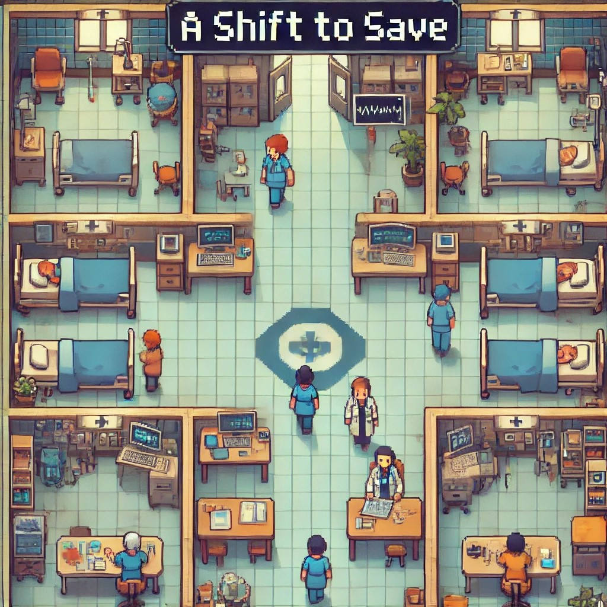

# A Shift To Save

  <h3><strong>A Journey of Healing, Heart, and Hard Choices</strong></h3>

  

### Description
*A Shift To Save* is an immersive single-player RPG (with plans for a future co-op mode) that places you in the role of a nurse navigating the challenges of a bustling hospital. Balancing patient care with moral dilemmas and tight time constraints, players make crucial decisions to save lives, earn the trust of coworkers, and advance through the hospital ranks. As you perform well, you’ll unlock promotions, special missions, and new responsibilities, ultimately aiming to become the hospital manager. This game reflects the intensity, compassion, and resilience required on the frontlines of healthcare.

### Key Features

- **Audience:** Recommended for ages 14+  
- **Game Modes:** Single-player with planned co-op mode  
- **Goals:** Save patients, support coworkers, and earn their trust to achieve promotions  
- **Gameplay:** Handle urgent cases, manage relationships with coworkers, and level up professional skills  
- **End Goal:** Climb the ranks to become the hospital manager or face the consequences of poor performance  
- **Creators:** Koren Abdush, Amit Gini  

- **More Information:** [Formal Elements Document](https://github.com/GiniProj/Shift-To-Save/blob/main/Formal-elements.md)  

### Game Components

- **Trust Meter:** Build or lose trust with coworkers based on the decisions you make.
- **Special Levels:** Unlock extra challenges and promotions by maintaining high performance.
- **Urgency System:** Prioritize calls and make quick decisions based on patient needs and time constraints.

---

Experience the dedication, intense decision-making, and the tough choices nurses face every day in *A Shift To Save*!
